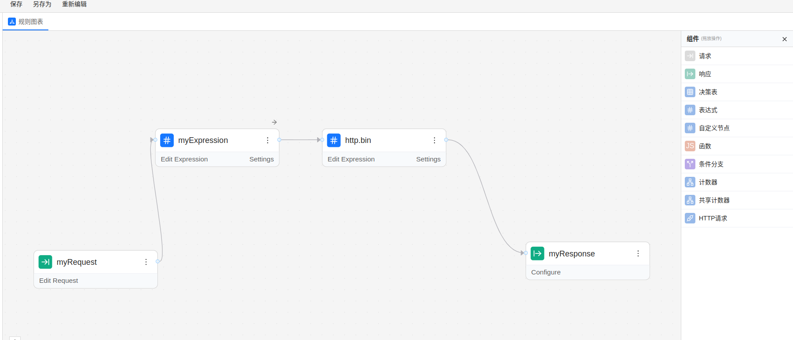

# zen-rule

zen-rule 是 [zen-engine](https://pypi.org/project/zen-engine/) 加强版本:
  
1. 提供多个 decision 的缓存.  
2. 提供自定义节点中多个函数调用表达式的定义, 解析和调用规范.  

## example

推荐线上使用 decision 缓存模式, 这样规则只需要加载，解析一次后重复使用，提高系统性能.  
每次先判断zenRule实例中是否有规则的缓存，如果没有则去加载规则图; 如果有就直接通过规则键去调用规则对入参进行处理, 得到最后规则的输出.

```python
from pathlib import Path
from zen_rule import ZenRule, udf


async def test_zenrule():
    """
        推荐线上生产环境使用此模式进行规则执行, 可以缓存决策对象, 提高性能.
    """
    zr = ZenRule({})
    basedir = Path(__file__).parent
    filename = basedir / "graph" / "custom_v3.json"
    key = filename

    if not zr.get_decision_cache(key):
        # 根据实际情况去加载规则图的内容.
        with open(filename, "r", encoding="utf8") as f:
            logger.warning(f"graph json: %s", filename)
            content =  f.read()
        zr.create_decision_with_cache_key(key, content)  # 将规则图缓存在键下, 这样可以只读取规则一次，解析一次，然后复用决策对象 decision
    result = await zr.async_evaluate(key, {"input": 7, "myvar": 15})
    print("zen rule custom_v3 result:", result)
```


如果提供 loader 函数, 就是如下调用示例.  
```python
from pathlib import Path
from zen_rule import ZenRule, udf


def loader(key):
    basedir = Path(__file__).parent
    filename = basedir / "graph" / key
    with open(filename, "r", encoding="utf8") as f:
        logger.warning(f"graph json: %s", filename)
        return f.read()


async def test_zenrule_with_loader():
    zr = ZenRule({"loader": loader})

    result = await zr.async_evaluate("custom_v3.json", {"input": 7, "myvar": 15})
    print("zen rule custom_v3 result:", result)

    result = await zr.async_evaluate("custom_v3.json", {"input": 7, "myvar": 15})
    print("zen rule custom_v3 result2:", result)
```

示例程序请参考 main.py, 运行 python main.py 即可运行测试示例.  

包含自定义函数示例的规则:  
[custom_v3.json](graph/custom_v3.json)  


## 自定义算子规范v3

在决策引擎中, 自定义算子主要承担外部数据查询, 状态交互, 以及一些自定义功能拓展. 
考虑到界面中会对自定义算子进行分类, 这时候在某个自定义类别的节点中只能访问这个类别的函数,
这样有利于降低最后用户的使用难度. 


  


### 格式一

如果支持不同自定义算子的嵌套, 那么这些节点分类就形同虚设.
考虑到自定义算子再未来的功能以及演化, 暂时决定自定义算子不支持嵌套调用和解析.
参考 zen-engine 的表达式测试用例. 为了简化参数的解析, 决定选用 `;;` 作为函数的分隔符号.

> foo;;myvar ;;max([5, 8, 2, 11, 7]);;rand(100);; 'fccd;;jny' ;;3+4

表示 foo 算子传入了五个参数:
1. zen 表达式变量 myvar
2. zen 表达式函数 max([5, 8, 2, 11, 7])
3. zen 表达式 rand(100)
4. zen 表达式 'fccd;;jny'
5. zen 表达式 3+4


解析后得到如下结构, 解释执行即可:

> ["foo", "myvar", "max([5, 8, 2, 11, 7])", "rand(100)", "fccd;;jny", "3+4"]

解析逻辑如下:

```python
def parse_oprator_expr_v3(expr):
    # 不能简单使用字符串分割, 因为字符串中可能会有分隔符的模式出现, 比如:
    # foo ;; myvar ;; bar(zoo('fccd;;jny',6, 3.14),'a');; a+string(xxx)
    # foo;;myvar;;max([5, 8, 2, 11, 7]);;rand(100);; 'fccd;;jny' ;;3+4
    # expr.split(";;")
    pattern = r""";;(?=(?:[^"'`]*["'`][^"'`]*["'`])*[^"'`]*$)"""
    # To split the string by these semicolon:
    _parts = re.split(pattern, expr)
    parts = [i.strip() for i in _parts]  # 去掉表达式前后的空格
    return parts
```

### 格式二

第二种就是保留技术更为熟悉的函数嵌套调用结构.
这种格式需要解析函数的嵌套调用, 还需要解析各种常量语法结构, 比如 数字， 布尔，字符串，数组，object对象, 
以及各种数组和字符串下标索引访问和切片访问语法格式, 还有中缀表达式(算术运算和逻辑运算), 非空判定, 三元表达式.

这部分需要使用上下无关文法定义解析或者peg语法解析.

> foo(myvar,max([5, 8, 2, 11, 7]),rand(100), 'fccd;;jny', 3+4)


解析后格式如下:

> [["foo", "myvar", "max([5, 8, 2, 11, 7])", "rand(100)", "'fccd;;jny'", "3+4"]]

此实现需要不断的去补充关于 zen 表达式语法结构的解析.  
详细参考 tests/test_zen_expr_parser.py 中的实现. 
```bash
$ python '/home/ryefccd/workspace/zen-rule/tests/test_zen_expr_parser.py'
foo(myvar,max([5, 8, 2, 11, 7]),rand(100), 'fccd;;jny', 3+4) --> [['foo', 'myvar', 'max([5, 8, 2, 11, 7])', 'rand(100)', "'fccd;;jny'", '3+4']]
...
```

目前使用 pyparsing 来解析, 将来考虑使用[lark](https://github.com/lark-parser/lark) 来做语法解析.

### 解析后格式

```json
{
    "id": "138b3b11-ff46-450f-9704-3f3c712067b2",
    "type": "customNode",
    "position": {
    "x": 470,
    "y": 240
    },
    "name": "customNode1",
    "content": {
    "kind": "sum",
    "config": {
        "version": "v2",
        "meta": {
        "user": "wanghao@geetest.com",
        "proj": "proj_id"
        },
        "prop1": "{{ a + 10 }}",
        "passThrough": true,
        "inputField": null,
        "outputPath": null,
        "expressions": [/*expressions 是约定的前端格式*/
        {
            "id": "52d41e3d-067d-4930-89bd-832b038cd08f",
            "key": "result",
            "value": "foo;;myvar ;;max([5, 8, 2, 11, 7]);;rand(100);; 'fccd;;jny' ;;3+4"
        }
        ],
        "expr_asts": [/*expr_asts 是后端解析动态产生的*/
        {
            "id": "52d41e3d-067d-4930-89bd-832b038cd08f",
            "key": "result",
            "value": ["foo", "myvar", "max([5, 8, 2, 11, 7])", "rand(100)", "\\'fccd;;jny\\'", "3+4"]
        }
        ]
    }
    }
}
```


## develop

使用如下命令构建开发环境，安装依赖库  

> uv pip install -e .

使用此命令将当前包以编辑模式(--editable, -e)安装在当前的虚拟环境中, 这样可以使用 `python main.py` 运行程序即可.

```bash
(zen-rule) ryefccd@republic:~/workspace/zen-rule$ uv pip list
Package                  Version Editable project location
------------------------ ------- --------------------------------
...                      ...
zen-engine               0.49.1
zen-rule                 0.10.1  /home/ryefccd/workspace/zen-rule
```

### 包构建

先把 dist 包中的文件删除, 然后 uv build 执行构建.

```bash
rm -r dist  
uv build
```

### 包发布

需要在 pypi 上创建一个账号, 在完成 `uv build` 之后, 使用 `uv publish` 进行包的上传.

```bash
uv publish
```


To set your API token for PyPI, you can create a $HOME/.pypirc similar to:

```ini
[pypi]
username = __token__
password = <PyPI token>
```

[Using a PyPI token](https://packaging.python.org/en/latest/specifications/pypirc/#using-a-pypi-token)  
[Building and publishing a package](https://docs.astral.sh/uv/guides/package/#publishing-your-package)  


## unit tests

增加多个python版本的测试.

## logging

[Configuring Logging for a Library](https://docs.python.org/3/howto/logging.html#configuring-logging-for-a-library)  
[What are the uses of Null handler in python logging?](https://stackoverflow.com/a/76887486)  


## reference

[Setting up testing with pytest and uv](https://pydevtools.com/handbook/tutorial/setting-up-testing-with-pytest-and-uv/)  

pypi src:

- https://pypi.org/simple/


json diff: https://jsoncrack.com/editor