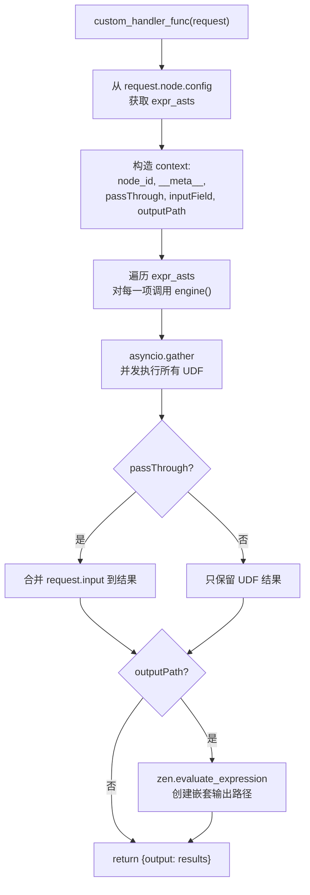
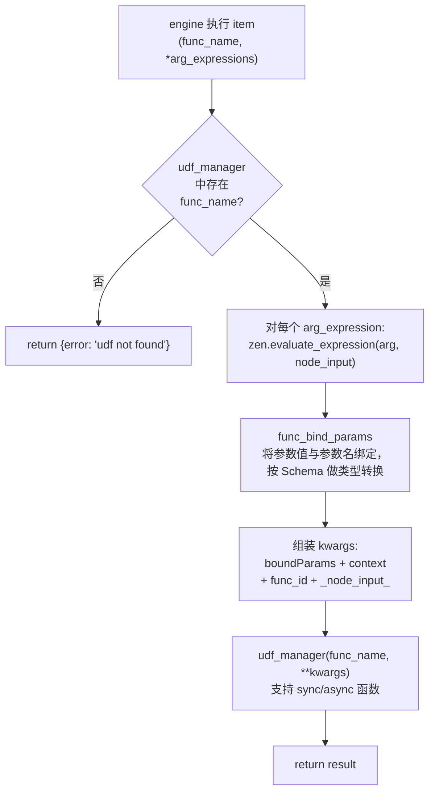
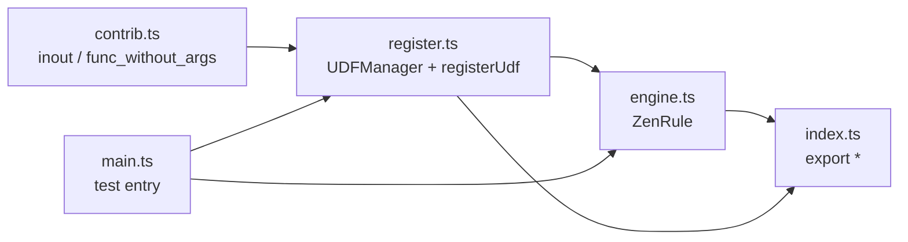
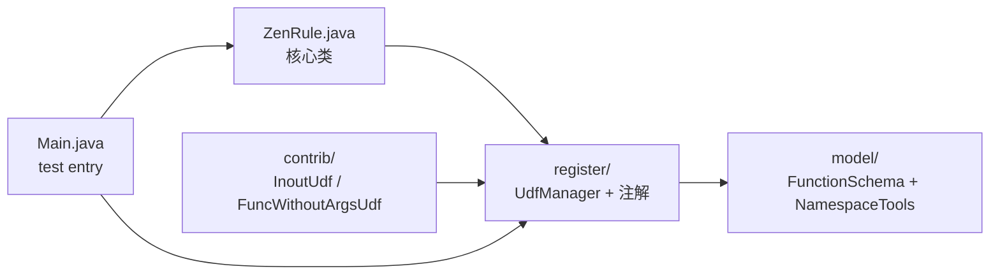

# zen-rule 架构文档

## 项目定位

zen-rule 是 [zen-engine](https://pypi.org/project/zen-engine/)（GoRules 业务规则引擎的 Python 绑定）的增强库，提供两大核心能力：

1. **决策缓存**：将 `ZenDecision` 对象缓存在内存中，避免重复加载和解析规则图，提升线上执行性能。
2. **自定义节点（Custom Node）规范**：在 zen-engine 的 `customHandler` 机制之上，定义了自定义函数（UDF）的注册、JSON Schema 提取、参数绑定和表达式解析规范，并兼容 OpenAI function calling 的工具函数格式。

当前版本：`0.30.0`，Python 要求 `>=3.8`。

---

## 目录结构

```
zen-rule/
├── src/zen_rule/                   # 核心 Python 包（hatchling 构建，PEP 621）
│   ├── __init__.py                #   导出 ZenRule, udf, udf_manager
│   ├── engine.py                  #   ZenRule 主类：决策缓存、图增强、自定义节点处理
│   ├── register.py                #   UDFManager、@udf 装饰器、函数签名→Schema 提取
│   ├── contrib.py                 #   内置 UDF（inout、func_without_args）
│   └── py.typed                   #   PEP 561 类型标记
├── docs/                          # 规范文档
│   ├── architecture.md            #   本文档
│   ├── jdm.md                     #   JSON Decision Model 规范
│   ├── jdm-editor.md              #   编辑器节点规范
│   ├── udf_spec.md                #   自定义函数 JSON Schema 规范
│   ├── zen-expression.md          #   zen 表达式语言
│   └── zen-engine-node-types.md   #   zen-engine 节点类型
├── tests/                         # pytest 测试
│   ├── bench/                     #   基准测试（pytest-benchmark）
│   ├── zen/                       #   引擎集成测试（单节点、异步、表达式、节点类型）
│   ├── parser/                    #   解析器测试
│   ├── data/                      #   测试数据
│   ├── conftest.py                #   公共 fixture
│   └── pytest.ini                 #   pytest 配置
├── graph/                         # 示例规则图 JSON（custom.json, custom2.json, custom_fullnode.json）
├── archive/                       # 自定义节点规范历史版本（v0~v3）及演进说明
├── packages/zen-rule/             # TypeScript 重写子项目（实验性）
├── java/                          # Java 移植子项目（Maven + zen-engine）
├── main.py                        # 演示入口（含自定义函数 foo 示例）
├── func_schema.py                 # 函数 Schema 提取演示
├── utils.py                       # contextvars 工具（演示 customHandler 中的状态传递）
├── pyproject.toml                 # PEP 621 配置、uv workspace、bumpversion
├── requirements.txt               # 运行时依赖
└── requirements_dev.txt           # 开发依赖
```

---

## 核心模块

### engine.py — ZenRule 主类

ZenRule 是面向业务代码的入口类，封装了 `zen.ZenEngine`。

**主要职责：**

- **决策缓存管理**：`decision_cache`（key → ZenDecision）和 `content_cache`（key → 原始 JSON 字符串），支持创建、更新、删除、查询。
- **图增强（graph_addons）**：在 `create_decision` 之前对规则图 JSON 进行后处理，注入运行时元信息并解析自定义节点中的表达式 AST。
- **自定义节点回调（custom_handler_func）**：作为 `customHandler` 注入 `zen.ZenEngine`，在决策执行到 `customNode` 时被调用。
- **表达式解析（parse_oprator_expr）**：将 `;;` 分隔的 UDF 调用字符串拆解为 AST 数组。

### register.py — UDF 注册与 Schema 提取

**主要职责：**

- **UDFManager**：全局单例，管理所有注册的自定义函数，提供按名查找、参数绑定、Schema 查询。
- **@udf 装饰器**：将 Python 函数注册进 `udf_manager`，可选指定 `namespace` 分组。
- **函数签名 → JSON Schema 提取**：利用 `inspect.signature` 获取参数类型和默认值，`docstring_parser` 提取文档注释，`pydantic.BaseModel` 生成 JSON Schema，结果兼容 OpenAI function calling 的 `function` schema 格式。

### contrib.py — 内置 UDF

包含两个内置调试函数：

- `inout`：返回节点入参，用于调试数据流。
- `func_without_args`：无参数版本，同样用于调试。

内置函数通过 `@udf()` 注册，随 `from .contrib import *` 在 engine 模块导入时自动注册。

---

## 执行流程

### 决策创建与评估

```mermaid
flowchart TD
    A["用户代码"] --> B["ZenRule(options)"]
    B --> C["创建 zen.ZenEngine\n(customHandler, loader)"]
    A --> D["create_decision_with_cache_key(key, content)"]
    D --> E["graph_addons(content)\n图增强"]
    E --> F["engine.create_decision()\n创建 ZenDecision"]
    F --> G["缓存 decision / content"]
    A --> H["async_evaluate(key, ctx)"]
    H --> I{"缓存中有 decision?"}
    I -->|"是"| J["取出 decision"]
    I -->|"否" & "有 loader"| K["loader(key)\n→ graph_addons → create_decision\n→ 放入缓存"]
    I -->|"否" & "无 loader"| L["抛异常"]
    K --> J
    J --> M["decision.async_evaluate(ctx)\n执行规则图"]
    M --> N["返回 {performance, result, trace}"]
```

### graph_addons 图增强

在 `create_decision` 之前，对规则图 JSON 进行以下后处理：

1. **注入 inputNode 名称**：找到 `inputNode` 节点的 `name`，写入所有 `customNode` 的 `__meta__` 中，方便自定义函数访问全局入参。
2. **注入规则元信息**：将 `graph.id` 写入 `__meta__.namespace`，使自定义函数可感知当前规则。
3. **默认 passThrough**：`customNode` 的 `passThrough` 默认设为 `true`（透传行为）。
4. **解析表达式 AST**：遍历 `config.expressions`，对每个表达式调用 `parse_oprator_expr` 解析 `;;` 分隔符，生成 `expr_asts`。

### 自定义节点回调



### UDF 调用



---

## 关键设计决策

### loader 必须同步

ZenRule 支持通过 `options["loader"]` 传入一个加载函数，按 key 返回规则图 JSON 字符串。此函数**必须为同步函数**，因为 Rust 侧的 `ZenEngine.get_decision` 是同步调用 loader 的，异步 loader 会导致线程阻塞。

```python
# ❌ 错误：loader 不能是 async
async def loader(key):
    ...

# ✅ 正确：loader 必须是同步函数
def loader(key):
    ...
```

### `;;` 分隔符

自定义节点中的 UDF 调用表达式使用 `;;` 作为分隔符，原因：

1. 避免与 zen 表达式中的单字符 `;` 冲突。
2. 支持字符串字面量中包含分隔符的情况（如 `'fccd;;jny'`）。

解析时使用正则 `r""";;(?=(?:[^"'`]*["'`][^"'`]*["'`])*[^"'`]*$)"""` 进行引号感知分割，确保字符串内部的 `;;` 不会被误切。

详见 [archive/readme.md](../archive/readme.md) 中自定义节点规范 v1~v3 的演进说明。

### `__meta__` 注入与 contextvars 限制

`graph_addons` 会将规则元信息（namespace、inputNode 名称）注入每个 `customNode` 的 `__meta__` 字段中，自定义函数通过 `kwargs["__meta__"]` 获取。

注意：Python 的 `contextvars`（见 `utils.py`）**无法穿透** zen-engine 的 Rust FFI 边界传递到 `customHandler` 中。如需在自定义函数中访问全局状态（如数据库连接、HTTP Session），需通过 `__meta__` 或 `_node_input_` 显式传递。

### passThrough 默认 true

`customNode` 的 `passThrough` 默认为 `true`，表示自定义节点的输出会自动包含原始输入（透传）。显式设为 `false` 时，输出仅包含 UDF 的计算结果。

---

## UDF Schema 规范

### 提取管线

```
Python 函数定义
  │
  ├─ inspect.signature()          → 参数名、类型注解、默认值
  ├─ docstring_parser.parse()     → 参数文档、返回值文档
  └─ pydantic.create_model()      → 参数模型 → model_json_schema()
       │
       └─ 合并为 OpenAI function calling 兼容格式：
          {
            name: "函数名",
            title: "函数名",
            type: "function",
            description: "函数文档",
            parameters: { type: "object", properties: {...}, required: [...] },
            returns: { type: "...", properties: {...} },
            namespace: "模块名",
            kind: "模块名"
          }
```

### namespace 分组

`@udf(namespace="http")` 可为函数指定命名空间，`udf_function_schema_tools()` 会按 namespace 分组返回，便于前端按分类展示 UDF 列表。

### 返回值扩展

在标准 `parameters` 同级增加 `returns` 字段，描述函数返回值的 JSON Schema，用于前端编辑表达式时的输入提示和补全。

详细规范见 [udf_spec.md](./udf_spec.md)。

---

## TypeScript 重写子项目

### 背景

`packages/zen-rule/` 是 zen-rule 的 TypeScript 重写实验，使用 [Bun](https://bun.sh/) 作为运行时，依赖 `@gorules/zen-engine` 的 TypeScript 绑定。目标是提供与 Python 版功能等价的 TypeScript SDK。

### 项目结构

```
packages/zen-rule/
├── package.json           # Bun + ESM 配置，依赖 @gorules/zen-engine
├── tsconfig.json          # target: ES2022, module: ESNext, strict: true
├── src/
│   ├── index.ts           # 导出 ZenRule, udfManager, registerUdf
│   ├── register.ts        # UDFManager class + registerUdf() 工厂函数
│   ├── engine.ts          # ZenRule 核心类（约 300 行）
│   └── contrib.ts         # 内置 UDF（inout, func_without_args）
├── graph/                 # 复用项目根目录的规则图 JSON
├── main.ts                # 测试入口（对应 main.py）
├── custom.json            # 示例规则图
├── custom_fullnode.json   # 示例规则图（全节点类型）
├── PLAN.md                # 详细重写执行计划与方法映射
└── bun.lock               # Bun 锁文件
```

### 模块依赖关系



### Python → TypeScript 方法映射

| Python 方法 | TypeScript 方法 | 行为差异 |
|------------|----------------|---------|
| `__init__(options)` | `constructor(options?)` | 使用 `new ZenEngine(options)` |
| `create_decision(content)` | `createDecision(content)` | 相同 |
| `create_decision_with_cache_key(key, content)` | `createDecisionWithCacheKey(key, content)` | 相同 |
| `update_decision_with_cache_key(key, content)` | `updateDecisionWithCacheKey(key, content)` | 相同 |
| `delete_decision_with_cache_key(key)` | `deleteDecisionWithCacheKey(key)` | 相同 |
| `get_decision(key)` | `getDecision(key)` | 缓存查找 + loader fallback |
| `evaluate(key, ctx, options?)` | `evaluate(key, ctx, options?)` | TS `evaluate()` 是同步的 |
| `async_evaluate(key, ctx, options?)` | `evaluateAsync(key, ctx, options?)` | 相同返回 Promise |
| `graph_addons(graphContent)` | `graphAddons(graphContent)` | 逻辑等价 |
| `parse_oprator_expr(expr)` | `parseOperatorExpr(expr)` | 正则拆分逻辑等价 |

### 关键差异

#### Schema 提取方式

Python 通过 `inspect.signature()` + `docstring_parser` 在运行时自动提取函数参数的类型和文档。TypeScript 的类型在编译期被擦除，运行时无法反射，因此 schema 改为**显式可选参数**：

```typescript
// TS：需手动传入 schema（可选）
udfManager.registerFunction(fn, "http", {
  parameters: { url: { type: "string" } },
  returns: { type: "object" },
});
```

无 schema 时函数仍可正常工作，但不会有参数绑定和类型转换。

#### 装饰器 → 工厂函数

Python 的 `@udf(namespace="...")` 装饰器语法在 TS 中非标准（实验性语法），改用 `registerUdf` 工厂函数：

```typescript
export function registerUdf(name: string, namespace?: string, schema?: UdfSchema) {
  return (fn: Function) => {
    udfManager.registerFunction(fn, namespace, schema);
    return fn;
  };
}
```

#### contextvars 无等价物

Python 的 `contextvars.ContextVar` 在 TS/JS 中没有直接等价物。如需在自定义函数中访问全局状态（如 HTTP 请求上下文），用户需自行通过 closure 或模块级变量实现。

### 运行方式

```bash
cd packages/zen-rule
bun install
bun run main.ts
```

详细实现计划与 API 适配细节见 [packages/zen-rule/PLAN.md](../packages/zen-rule/PLAN.md)。

---

## Java 移植子项目

### 背景

`java/` 是 zen-rule 的 Java 移植，使用 Maven 构建，依赖 [io.gorules:zen-engine](https://central.sonatype.com/artifact/io.gorules/zen-engine) 的 Java 绑定（UniFFI 生成）。要求 **JDK 21+**。

### 项目结构

```
java/
├── pom.xml                        # Maven 配置（zen-engine 0.4.7, Jackson, SLF4J）
├── src/main/java/io/gorules/zen_rule/
│   ├── ZenRule.java               # 核心类：决策缓存、图增强、自定义节点处理、UDF 执行
│   ├── Main.java                  # 测试入口（对应 main.py）
│   ├── model/
│   │   ├── FunctionSchema.java    # UDF JSON Schema 模型
│   │   └── NamespaceTools.java    # Namespace 分组模型
│   ├── register/
│   │   ├── Udf.java               # @Udf 注解
│   │   ├── UdfParam.java          # @UdfParam 注解
│   │   ├── UdfKwargs.java         # @UdfKwargs 注解（模拟 Python **kwargs）
│   │   ├── UdfManager.java        # UDF 注册表：反射提取签名、类型转换、执行
│   │   └── FunctionSchemaBuilder.java  # 反射 → JSON Schema 构建器
│   └── contrib/
│       ├── InoutUdf.java          # 内置 UDF: inout
│       └── FuncWithoutArgsUdf.java # 内置 UDF: func_without_args
└── src/main/resources/graph/
    ├── custom.json                # 测试规则图
    └── custom_fullnode.json       # 测试规则图（含 foo UDF 调用）
```

### 模块依赖关系



### Python → Java 方法映射

| Python 方法 | Java 方法 | 行为差异 |
|------------|-----------|---------|
| `__init__(options)` | `ZenRule(options)` | 构造函数，Java loader 为 `ZenDecisionLoaderCallback`（异步） |
| `create_decision(content)` | `createDecision(content)` | 包装 `ZenException` |
| `create_decision_with_cache_key(key, content)` | `createDecisionWithCacheKey(key, content)` | 同步调用 |
| `update_decision_with_cache_key(key, content)` | `updateDecisionWithCacheKey(key, content)` | 同步调用 |
| `delete_decision_with_cache_key(key)` | `deleteDecisionWithCacheKey(key)` | 同步调用 |
| `get_decision(key)` | `getDecision(key)` | 缓存查找 |
| `evaluate(key, ctx)` | `evaluate(key, ctx)` | 返回 `CompletableFuture<ZenEngineResponse>` |
| — | `evaluateSync(key, ctx)` | Java 新增同步版本，`.join()` 等待结果 |
| `graph_addons(content)` | `graphAddons(content)` | 逻辑等价 |
| `parse_oprator_expr(expr)` | `parseOperatorExpr(expr)` | 正则拆分逻辑等价 |
| — | `registerDefaultUdfs(udfManager)` | 注册内置 contrib UDF |

### 关键差异

#### loader 为异步接口

Java 版的 `ZenDecisionLoaderCallback.load()` 返回 `CompletableFuture<JsonBuffer>`，与 Python 版的同步 loader 不同。

#### @UdfKwargs 注解

Python 的 `**kwargs` 在 Java 中无直接等价物。通过 `@UdfKwargs` 注解标记 `Map<String, Object>` 参数，`UdfManager.execute` 会将整个 kwargs map 传入该参数。

#### UDF 类型转换

Java 没有动态类型，`UdfManager.execute` 中的 `coerceType` 方法负责将 JSON 值（通常是 `Integer`/`Double`）转换为方法参数的目标类型。

#### 内置 UDF 注册

Python 版通过 `from .contrib import *` 自动注册。Java 版通过 `ZenRule.registerDefaultUdfs(udfManager)` 手动调用。

### 运行方式

```bash
# 需要 JDK 21+
$env:JAVA_HOME = "path/to/jdk-21"
mvn -f java/pom.xml compile exec:java
```

Maven 代理配置见 `~/.m2/settings.xml`。

---

## 文档索引

| 文档 | 内容 |
|------|------|
| [jdm.md](./jdm.md) | JSON Decision Model（JDM）规范，定义规则图 JSON 结构 |
| [jdm-editor.md](./jdm-editor.md) | 规则图编辑器节点规范 |
| [udf_spec.md](./udf_spec.md) | 自定义函数 JSON Schema 规范（含 namespace 分组、returns 扩展） |
| [zen-expression.md](./zen-expression.md) | zen 表达式语言说明 |
| [zen-engine-node-types.md](./zen-engine-node-types.md) | zen-engine 支持的节点类型 |
| [archive/readme.md](../archive/readme.md) | 自定义节点规范 v0~v3 演进史 |
| [tests/readme.md](../tests/readme.md) | pytest / coverage / benchmark 使用指南 |
| [packages/zen-rule/PLAN.md](../packages/zen-rule/PLAN.md) | TypeScript 重写执行计划与方法映射 |
