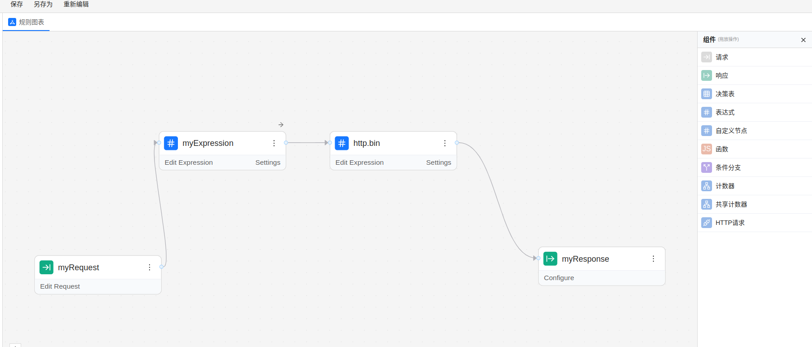

# zen-rule


## 自定义算子规范v3

在决策引擎中, 自定义算子主要承担外部数据查询, 状态交互, 以及一些自定义功能拓展. 
考虑到界面中会对自定义算子进行分类, 这时候在某个自定义类别的节点中只能访问这个类别的函数,
这样有利于降低最后用户的使用难度. 


  


### 格式一

如果支持不同自定义算子的嵌套, 那么这些节点分类就形同虚设.
考虑到自定义算子再未来的功能以及演化, 暂时决定自定义算子不支持嵌套调用和解析.
参考 zen-engine 的表达式测试用例. 为了简化参数的解析, 决定选用 `;;` 作为函数的分隔符号.

> foo;;myvar;;bar(zoo('fccdjny',6, 3.14),'a');; a+string(xxx)

表示 foo 算子传入了 三个参数:
1. zen 表达式变量 myvar
2. zen 表达式函数 bar(zoo('fccdjny',6, 3.14),'a')
3. zen 表达式 a+string(xxx)

```c
foo;;myvar ;;max([5, 8, 2, 11, 7]);;rand(100);; 'fccd;;jny' ;;3+4
```

### 格式二

第二种就是保留技术更为熟悉的函数嵌套调用结构.
这种格式需要解析函数的嵌套调用, 还需要解析各种常量语法结构, 比如 数字， 布尔，字符串，数组，object对象, 
以及各种数组和字符串下标索引访问和切片访问语法格式, 还有中缀表达式(算术运算和逻辑运算), 非空判定, 三元表达式.

这部分需要使用上下无关文法定义解析或者peg语法解析.

> foo(myvar,bar(zoo('fccdjny',6, 3.14),'a'), a+string(xxx))


### 解析后格式

```json

    "expressions": [
      {
        "id": "52d41e3d-067d-4930-89bd-832b038cd08f",
        "key": "result",
        "value": "foo;;myvar;;max([5, 8, 2, 11, 7]);;rand(100)"
      }
    ],
    "expr_asts": [
      {
        "id": "52d41e3d-067d-4930-89bd-832b038cd08f",
        "key": "result",
        "value": ["foo", "myvar", "max([5, 8, 2, 11, 7])", "rand(100)"]
      }
    ]

```


### 完全示例

```json
{
  "contentType": "application/vnd.gorules.decision",
  "nodes": [
    {
      "id": "115975ef-2f43-4e22-b553-0da6f4cc7f68",
      "type": "inputNode",
      "position": {
        "x": 180,
        "y": 240
      },
      "name": "Request"
    },
    {
      "id": "138b3b11-ff46-450f-9704-3f3c712067b2",
      "type": "customNode",
      "position": {
        "x": 470,
        "y": 240
      },
      "name": "customNode1",
      "content": {
        "kind": "sum",
        "config": {
          "version": "v3",
          "meta": {
            "user": "wanghao@geetest.com",
            "proj": "proj_id"
          },
          "prop1": "{{ a + 10 }}",
          "passThrough": true,
          "inputField": null,
          "outputPath": null,
          "expressions": [
            {
              "id": "52d41e3d-067d-4930-89bd-832b038cd08f",
              "key": "result",
              "value": "foo;;myvar;;bar(zoo('fccdjny',6, 3.14),'a');; bas()",
            }
          ],
          "expr_asts": [
            {
              "id": "52d41e3d-067d-4930-89bd-832b038cd08f",
              "key": "result",
              "value": ["foo", "myvar", "bar(zoo('fccdjny',6, 3.14),'a')", "a+string(xxx)"]
            }
          ]
        }
      }
    },
    {
      "id": "db8797b1-bcc1-4fbf-a5d8-e7d43a181d5e",
      "type": "outputNode",
      "position": {
        "x": 780,
        "y": 240
      },
      "name": "Response"
    }
  ],
  "edges": [
    {
      "id": "05740fa7-3755-4756-b85e-bc1af2f6773b",
      "sourceId": "115975ef-2f43-4e22-b553-0da6f4cc7f68",
      "type": "edge",
      "targetId": "138b3b11-ff46-450f-9704-3f3c712067b2"
    },
    {
      "id": "5d89c1d6-e894-4e8a-bd13-22368c2a6bc7",
      "sourceId": "138b3b11-ff46-450f-9704-3f3c712067b2",
      "type": "edge",
      "targetId": "db8797b1-bcc1-4fbf-a5d8-e7d43a181d5e"
    }
  ]
}

```


## 自定义算子规范v2

包含自定义函数示例的规则:  
[custom_v2.json](graph/custom_v2.json)  

```json
{
  "contentType": "application/vnd.gorules.decision",
  "nodes": [
    {
      "id": "115975ef-2f43-4e22-b553-0da6f4cc7f68",
      "type": "inputNode",
      "position": {
        "x": 180,
        "y": 240
      },
      "name": "Request"
    },
    {
      "id": "138b3b11-ff46-450f-9704-3f3c712067b2",
      "type": "customNode",
      "position": {
        "x": 470,
        "y": 240
      },
      "name": "customNode1",
      "content": {
        "kind": "sum",
        "config": {
          "version": "v2",
          "meta": {
            "user": "wanghao@geetest.com",
            "proj": "proj_id"
          },
          "prop1": "{{ a + 10 }}",
          "passThrough": true,
          "inputField": null,
          "outputPath": null,
          "expressions": [
            {
              "id": "52d41e3d-067d-4930-89bd-832b038cd08f",
              "key": "result",
              "value": "foo(myvar,bar(zoo('fccdjny',6, 3.14),'a'), bas())"
            }
          ]
        }
      }
    },
    {
      "id": "db8797b1-bcc1-4fbf-a5d8-e7d43a181d5e",
      "type": "outputNode",
      "position": {
        "x": 780,
        "y": 240
      },
      "name": "Response"
    }
  ],
  "edges": [
    {
      "id": "05740fa7-3755-4756-b85e-bc1af2f6773b",
      "sourceId": "115975ef-2f43-4e22-b553-0da6f4cc7f68",
      "type": "edge",
      "targetId": "138b3b11-ff46-450f-9704-3f3c712067b2"
    },
    {
      "id": "5d89c1d6-e894-4e8a-bd13-22368c2a6bc7",
      "sourceId": "138b3b11-ff46-450f-9704-3f3c712067b2",
      "type": "edge",
      "targetId": "db8797b1-bcc1-4fbf-a5d8-e7d43a181d5e"
    }
  ]
}

```

## parser

`python tests/test_parser.py` 以普通python程序运行测试程序.

### number

### string

解析字符串中不包含逗号

```python
    func_call_s = "msg_test('18271902319', '2025061611051974502', 'xxx')"  # 增加对 ['a', 'b', 'c'] 数组类型的解析.  # 已经实现支持
    expr_ast = zen_custom_expr_parse(func_call_s)
    print("expr    :", func_call_s)
    print("expr_ast:", expr_ast)
    pprint(expr_ast)
```


解析字符串中包含逗号
```python
    func_call_s = "msg_test('18271902319,15607101196,18727622961', '2025061611051974502', 'xxx')"  # 增加对 ['a', 'b', 'c'] 数组类型的解析.  # 已经实现支持
    expr_ast = zen_custom_expr_parse(func_call_s)
    print("expr    :", func_call_s)
    print("expr_ast:", expr_ast)
    pprint(expr_ast)
```

### array

```python
    func_call_s = "array_call([1,2,3], ['a', 'b', 'c'])"  # 增加对 ['a', 'b', 'c'] 数组类型的解析.  # 已经实现支持
    expr_ast = zen_custom_expr_parse(func_call_s)
    print("array_call expr    :", func_call_s)
    print("array_call expr_ast:", expr_ast)
    pprint(expr_ast)
```

### object

对函数调用中的 object 字面量进行解析.
```python
    func_call_s = """object_call({customer: { firstName: "John", lastName: "Doe" }}, ['a', 'b', 'c'])"""  # 增加对 ['a', 'b', 'c'] 数组类型的解析.  # 已经实现支持
    expr_ast = zen_custom_expr_parse(func_call_s)
    print("object_call expr    :", func_call_s)
    print("object_call expr_ast:", expr_ast)
    pprint(expr_ast)
```


Parsing Non-Strict JavaScript Objects (e.g., with single quotes, comments, trailing commas)

- [chompjs](https://github.com/Nykakin/chompjs): Designed specifically for parsing JavaScript objects that are not strictly JSON.

```python
    import chompjs

    js_object_string = "{ name: 'Bob', hobbies: ['reading', 'hiking'], /* a comment */ }"
    python_dict = chompjs.parse_js_object(js_object_string)

    print(python_dict)
```

- PyYAML:  Can parse a broader range of formats, including a subset of JavaScript object notation.

```python
    import yaml

    js_object_string = """
    {
        name: 'Charlie',
        data: {
            value: 123,
            status: true,
        }
    }
    """
    python_dict = yaml.safe_load(js_object_string)

    print(python_dict)
```

[How to convert raw javascript object to a dictionary?](https://stackoverflow.com/questions/24027589/how-to-convert-raw-javascript-object-to-a-dictionary)  


### custom node spec v2

将函数调用解析为抽象语法树后解释执行:

> foo(myvar,bar(zoo('fccdjny',6, 3.14),'a'), bas())

解析后得到如下语法树, 解释执行即可:

```python
[
    {
        "name": "zoo",
        "args": [["'fccdjny'", "string"], [6, "int"], [3.14, "float"]],
        "ns": "",
        "id": "566a36f923b34cbd9c159272adc988ae",
    },
    {
        "name": "bar",
        "args": [
            [
                {
                    "name": "zoo",
                    "args": [
                        ["'fccdjny'", "string"],
                        [6, "int"],
                        [3.14, "float"],
                    ],
                    "ns": "",
                    "id": "566a36f923b34cbd9c159272adc988ae",
                },
                "func_value",
            ],
            ["'a'", "string"],
        ],
        "ns": "",
        "id": "5d0b81e086d748d4902a35fd85bad974",
    },
    {
        "name": "bas",
        "args": [],
        "ns": "",
        "id": "7f8448aad2594b479f6df2e2241707c7",
    },
    {
        "name": "foo",
        "args": [
            ["myvar", "var"],
            [
                {
                    "name": "bar",
                    "args": [
                        [
                            {
                                "name": "zoo",
                                "args": [
                                    ["'fccdjny'", "string"],
                                    [6, "int"],
                                    [3.14, "float"],
                                ],
                                "ns": "",
                                "id": "566a36f923b34cbd9c159272adc988ae",
                            },
                            "func_value",
                        ],
                        ["'a'", "string"],
                    ],
                    "ns": "",
                    "id": "5d0b81e086d748d4902a35fd85bad974",
                },
                "func_value",
            ],
            [
                {
                    "name": "bas",
                    "args": [],
                    "ns": "",
                    "id": "7f8448aad2594b479f6df2e2241707c7",
                },
                "func_value",
            ],
        ],
        "ns": "",
        "id": "0c509d4654ef443eb621d791d3ffcaa1",
    },
]

```

使用示例如下:

```python

async def ast_exec():
    v = [{"name": "zoo", "args": [["'fccdjny'", "string"], [6, "int"], [3.14, "float"]], "ns": "", "id": "566a36f923b34cbd9c159272adc988ae"}, {"name": "bar", "args": [[{"name": "zoo", "args": [["'fccdjny'", "string"], [6, "int"], [3.14, "float"]], "ns": "", "id": "566a36f923b34cbd9c159272adc988ae"}, "func_value"], ["'a'", "string"]], "ns": "", "id": "5d0b81e086d748d4902a35fd85bad974"}, {"name": "bas", "args": [], "ns": "", "id": "7f8448aad2594b479f6df2e2241707c7"}, {"name": "foo", "args": [["myvar", "var"], [{"name": "bar", "args": [[{"name": "zoo", "args": [["'fccdjny'", "string"], [6, "int"], [3.14, "float"]], "ns": "", "id": "566a36f923b34cbd9c159272adc988ae"}, "func_value"], ["'a'", "string"]], "ns": "", "id": "5d0b81e086d748d4902a35fd85bad974"}, "func_value"], [{"name": "bas", "args": [], "ns": "", "id": "7f8448aad2594b479f6df2e2241707c7"}, "func_value"]], "ns": "", "id": "0c509d4654ef443eb621d791d3ffcaa1"}]

    await ast_exec(v, {"input": 7, "myvar": 15}, {"node_id": "nodexxxxx", "meta": {}})
```

