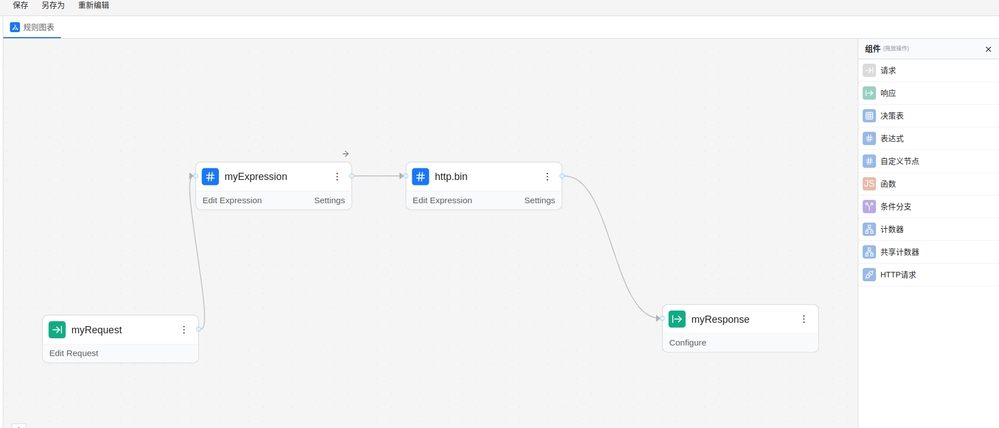

# zen-rule

## 自定义函数spec

描述自定义函数的 json schema 规范:

1. 在 json schema 中使用 title 当作名称.一般来说, title 字段和name字段保持一致，title字段是json schema 的标准定义, name 是 openai 中的function calling 定义, 定义name字段是为了让自定义函数调用可以兼容openai, 这样我们的自定义函数可以注册为兼容 openai 大模型(基本上大模型都兼容openai接口)的工具函数.
   不管任何层级，建议我们都使用 title 字段，那么name字段用来兼容openai.  
2. 顶层tools字段中就是自定义算子的 schema 定义，算子中的 parameters 字段是标准的 json schema 定义.
3. parameters.properties 中包含函数的参数，键的顺序就是算子中入参的顺序.
4. parameters.required 表示哪些参数是必传的.
5. 旧的自定义函数定义会在函数定义中有 arglength 表示函数参数个数，现在需要遍历 parameters.properties 中的选项得到参数个数，并且其迭代顺序代表参数顺序。
6. 自定义函数的返回值的 json schema 中增加与 parameters 统一层级的 returns 字段表示返回值定义. returns.content 表示函数返回值的内容定义, returns.content.schema 则是具体的字段及其类型定义. 简化前端编辑表达式时做输入提示和补全.

```json
[  
    {
        "type": "namespace", /*顶层type namespace 表示自定义节点定义*/
        "title": "http", /* title 是 json schema 的规范*/
        "name": "http", /* 自定义节点的名字 */
        "description": "",
        "tools": [ /* tools 表示自定义节点中的自定义算子(函数)列表*/
            {
                "name": "http_call",
                "title": "http_call",
                "type": "function",
                "description": "http 请求调用\n第一个参数是 url, 第二个参数是请求方法(\"get\"/\"post\"),\n第三个参数是请求体(zen context/object)",
                "parameters": {
                    "properties": {
                        "url": {
                            "description": "目标 url",
                            "title": "Url",
                            "type": "string"
                        },
                        "method": {
                            "default": "get",
                            "description": "请求方法(\"get\" 或者 \"post\")",
                            "title": "Method",
                            "type": "string"
                        },
                        "payload": {
                            "additionalProperties": true,
                            "default": {},
                            "description": "请求的参数(zen context/object)",
                            "title": "Payload",
                            "type": "object"
                        }
                    },
                    "required": [
                        "url"
                    ],
                    "title": "http_call",
                    "type": "object"
                },
                "returns": {
                    "description": "http call use define function return value",
                    "content": {
                        "schema": {
                            "type": "object",
                            "properties": {
                                "id": {
                                    "type": "integer",
                                    "description": "The user ID"
                                },
                                "username": {
                                    "type": "string",
                                    "description": "The user name"
                                }
                            }
                        }
                    }
                }，
                "namespace": "http",
                "kind": "http"
            },
            {
                "name": "http_call_with_headers",
                "title": "http_call_with_headers",
                "type": "function",
                "description": "http 请求调用\n第一个参数是 url, 第二个参数是请求方法(\"get\"/\"post\"),\n第三个参数是请求体(zen context/object),\n第四个参数是请求头headers(zen context/object).",
                "parameters": {
                    "properties": {
                        "url": {
                            "default": "",
                            "description": "目标 url",
                            "title": "Url",
                            "type": "string"
                        },
                        "method": {
                            "default": "",
                            "description": "请求方法(\"get\" 或者 \"post\")",
                            "title": "Method",
                            "type": "string"
                        },
                        "payload": {
                            "additionalProperties": true,
                            "default": {},
                            "description": "请求的参数(zen context/object)",
                            "title": "Payload",
                            "type": "object"
                        },
                        "headers": {
                            "additionalProperties": true,
                            "default": {},
                            "description": "请求头headers(zen context/object)",
                            "title": "Headers",
                            "type": "object"
                        }
                    },
                    "title": "http_call_with_headers",
                    "type": "object"
                },
                "namespace": "http",
                "kind": "http"
            }
        ]
    }
]
```


## 自定义算子规范v3

在决策引擎中, 自定义算子主要承担外部数据查询, 状态交互, 以及一些自定义功能拓展. 
考虑到界面中会对自定义算子进行分类, 这时候在某个自定义类别的节点中只能访问这个类别的函数,
这样有利于降低最后用户的使用难度. 


  


如果支持不同自定义算子的嵌套, 那么这些节点分类就形同虚设.
考虑到自定义算子再未来的功能以及演化, 暂时决定自定义算子不支持嵌套调用和解析.
参考 zen-engine 的表达式测试用例. 为了简化参数的解析, 决定选用 `;;` 作为函数的分隔符号.

> foo;;myvar ;;max([5, 8, 2, 11, 7]);;rand(100);; 'fccd;;jny' ;;3+4

表示 foo 算子传入了五个参数:
1. zen 表达式变量 myvar
2. zen 表达式函数 max([5, 8, 2, 11, 7])
3. zen 表达式 rand(100)
4. zen 表达式 'fccd;;jny'
5. zen 表达式 3+4


解析后得到如下结构, 解释执行即可:

> ["foo", "myvar", "max([5, 8, 2, 11, 7])", "rand(100)", "'fccd;;jny'", "3+4"]

解析逻辑如下:

```python
def parse_oprator_expr_v3(expr):
    # 不能简单使用字符串分割, 因为字符串中可能会有分隔符的模式出现, 比如:
    # foo;;myvar ;;max([5,8,2,11, 7]);;rand(100)+120;;3+4;; 'singel;;quote' ;;"double;;quote" ;;`backquote;; ${bar}`
    # expr.split(";;")
    pattern = r""";;(?=(?:[^"'`]*["'`][^"'`]*["'`])*[^"'`]*$)"""
    # To split the string by these semicolon:
    _parts = re.split(pattern, expr)
    parts = [i.strip() for i in _parts]  # 去掉表达式前后的空格
    return parts
```

### 解析后格式

```json

    "expressions": [
      {
        "id": "52d41e3d-067d-4930-89bd-832b038cd08f",
        "key": "result",
        "value": "foo;;myvar;;max([5, 8, 2, 11, 7]);;rand(100)"
      }
    ],
    "expr_asts": [
      {
        "id": "52d41e3d-067d-4930-89bd-832b038cd08f",
        "key": "result",
        "value": ["foo", "myvar", "max([5, 8, 2, 11, 7])", "rand(100)"]
      }
    ]

```


### 完全示例

```json
{
  "contentType": "application/vnd.gorules.decision",
  "nodes": [
    {
      "id": "115975ef-2f43-4e22-b553-0da6f4cc7f68",
      "type": "inputNode",
      "position": {
        "x": 180,
        "y": 240
      },
      "name": "Request"
    },
    {
      "id": "138b3b11-ff46-450f-9704-3f3c712067b2",
      "type": "customNode",
      "position": {
        "x": 470,
        "y": 240
      },
      "name": "customNode1",
      "content": {
        "kind": "sum",
        "config": {
          "version": "v3",
          "meta": {
            "user": "wanghao@geetest.com",
            "proj": "proj_id"
          },
          "prop1": "{{ a + 10 }}",
          "passThrough": true,
          "inputField": null,
          "outputPath": null,
          "expressions": [
            {
              "id": "52d41e3d-067d-4930-89bd-832b038cd08f",
              "key": "result",
              "value": "foo;;myvar;;bar(zoo('fccdjny',6, 3.14),'a');; bas()",
            }
          ],
          "expr_asts": [
            {
              "id": "52d41e3d-067d-4930-89bd-832b038cd08f",
              "key": "result",
              "value": ["foo", "myvar", "bar(zoo('fccdjny',6, 3.14),'a')", "a+string(xxx)"]
            }
          ]
        }
      }
    },
    {
      "id": "db8797b1-bcc1-4fbf-a5d8-e7d43a181d5e",
      "type": "outputNode",
      "position": {
        "x": 780,
        "y": 240
      },
      "name": "Response"
    }
  ],
  "edges": [
    {
      "id": "05740fa7-3755-4756-b85e-bc1af2f6773b",
      "sourceId": "115975ef-2f43-4e22-b553-0da6f4cc7f68",
      "type": "edge",
      "targetId": "138b3b11-ff46-450f-9704-3f3c712067b2"
    },
    {
      "id": "5d89c1d6-e894-4e8a-bd13-22368c2a6bc7",
      "sourceId": "138b3b11-ff46-450f-9704-3f3c712067b2",
      "type": "edge",
      "targetId": "db8797b1-bcc1-4fbf-a5d8-e7d43a181d5e"
    }
  ]
}

```


## 自定义算子规范v2

包含自定义函数示例的规则:  
[custom_v2.json](graph/custom_v2.json)  

```json
{
  "contentType": "application/vnd.gorules.decision",
  "nodes": [
    {
      "id": "115975ef-2f43-4e22-b553-0da6f4cc7f68",
      "type": "inputNode",
      "position": {
        "x": 180,
        "y": 240
      },
      "name": "Request"
    },
    {
      "id": "138b3b11-ff46-450f-9704-3f3c712067b2",
      "type": "customNode",
      "position": {
        "x": 470,
        "y": 240
      },
      "name": "customNode1",
      "content": {
        "kind": "sum",
        "config": {
          "version": "v2",
          "meta": {
            "user": "wanghao@geetest.com",
            "proj": "proj_id"
          },
          "prop1": "{{ a + 10 }}",
          "passThrough": true,
          "inputField": null,
          "outputPath": null,
          "expressions": [
            {
              "id": "52d41e3d-067d-4930-89bd-832b038cd08f",
              "key": "result",
              "value": "foo(myvar,bar(zoo('fccdjny',6, 3.14),'a'), bas())"
            }
          ]
        }
      }
    },
    {
      "id": "db8797b1-bcc1-4fbf-a5d8-e7d43a181d5e",
      "type": "outputNode",
      "position": {
        "x": 780,
        "y": 240
      },
      "name": "Response"
    }
  ],
  "edges": [
    {
      "id": "05740fa7-3755-4756-b85e-bc1af2f6773b",
      "sourceId": "115975ef-2f43-4e22-b553-0da6f4cc7f68",
      "type": "edge",
      "targetId": "138b3b11-ff46-450f-9704-3f3c712067b2"
    },
    {
      "id": "5d89c1d6-e894-4e8a-bd13-22368c2a6bc7",
      "sourceId": "138b3b11-ff46-450f-9704-3f3c712067b2",
      "type": "edge",
      "targetId": "db8797b1-bcc1-4fbf-a5d8-e7d43a181d5e"
    }
  ]
}

```

### custom node spec v2

将函数调用解析为抽象语法树后解释执行:

> foo(myvar,bar(zoo('fccdjny',6, 3.14),'a'), bas())

解析后得到如下语法树, 解释执行即可:

```python
[
    {
        "name": "zoo",
        "args": [["'fccdjny'", "string"], [6, "int"], [3.14, "float"]],
        "ns": "",
        "id": "566a36f923b34cbd9c159272adc988ae",
    },
    {
        "name": "bar",
        "args": [
            [
                {
                    "name": "zoo",
                    "args": [
                        ["'fccdjny'", "string"],
                        [6, "int"],
                        [3.14, "float"],
                    ],
                    "ns": "",
                    "id": "566a36f923b34cbd9c159272adc988ae",
                },
                "func_value",
            ],
            ["'a'", "string"],
        ],
        "ns": "",
        "id": "5d0b81e086d748d4902a35fd85bad974",
    },
    {
        "name": "bas",
        "args": [],
        "ns": "",
        "id": "7f8448aad2594b479f6df2e2241707c7",
    },
    {
        "name": "foo",
        "args": [
            ["myvar", "var"],
            [
                {
                    "name": "bar",
                    "args": [
                        [
                            {
                                "name": "zoo",
                                "args": [
                                    ["'fccdjny'", "string"],
                                    [6, "int"],
                                    [3.14, "float"],
                                ],
                                "ns": "",
                                "id": "566a36f923b34cbd9c159272adc988ae",
                            },
                            "func_value",
                        ],
                        ["'a'", "string"],
                    ],
                    "ns": "",
                    "id": "5d0b81e086d748d4902a35fd85bad974",
                },
                "func_value",
            ],
            [
                {
                    "name": "bas",
                    "args": [],
                    "ns": "",
                    "id": "7f8448aad2594b479f6df2e2241707c7",
                },
                "func_value",
            ],
        ],
        "ns": "",
        "id": "0c509d4654ef443eb621d791d3ffcaa1",
    },
]

```