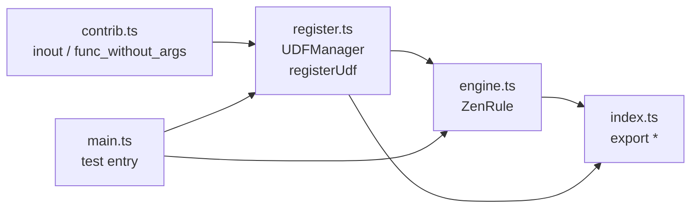
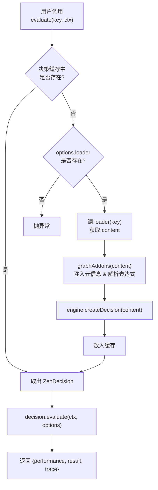
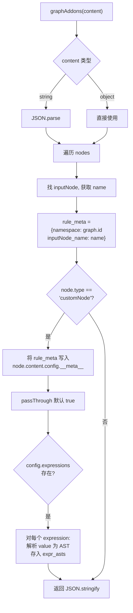
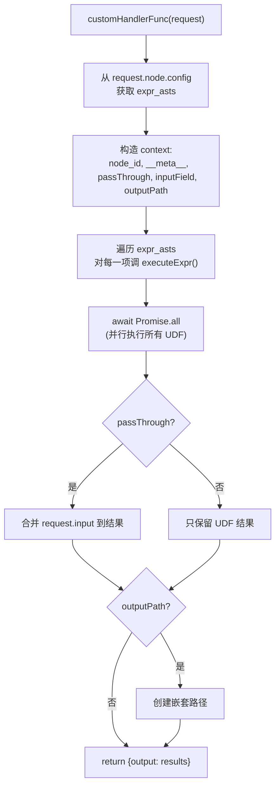
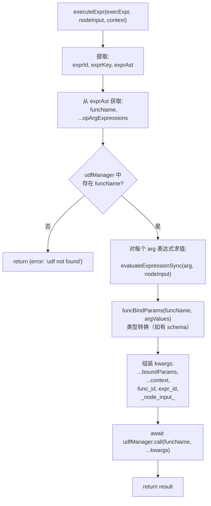

# zen-rule TypeScript 重写执行计划

## 项目结构

```
packages/zen-rule/
├── package.json              # Bun + ESM 项目配置, 依赖 @gorules/zen-engine
├── tsconfig.json             # TypeScript 编译配置 (target: ES2022, module: ESNext)
├── PLAN.md                   # 本文件
├── src/
│   ├── index.ts              # 导出 ZenRule, udfManager, registerUdf
│   ├── register.ts           # UDFManager + registerUdf() 辅助函数
│   ├── engine.ts             # ZenRule 核心类
│   └── contrib.ts            # 示例 UDF (inout, func_without_args)
├── graph/                    # 使用项目根目录的 graph/ 中的规则 JSON
└── main.ts                   # 参考 main.py 的测试入口
```

## 文件间依赖关系



## 实现步骤

### Step 1: `package.json` + `tsconfig.json`

**package.json**
- `"type": "module"` (ESM)
- 依赖: `@gorules/zen-engine` (latest)
- devDependencies: `typescript`, `bun-types`

**tsconfig.json**
- `target: "ES2022"`, `module: "ESNext"`, `moduleResolution: "bundler"`
- `strict: true`

### Step 2: `src/register.ts` — UDF 注册管理器

**Python 原型:**
```python
class UDFManager:
    def __init__(self):
        self.functions = {}
    def register_function(self, func, namespace=None):
        func_schema = function_schema(func)  # 通过 inspect+docstring 提取
        self.functions[func.__name__] = {"func": func, "schema": func_schema}
    async def __call__(self, udf_name, *args, **kwargs):
        func = self.functions[udf_name]["func"]
        return await func(*args, **kwargs) if iscoroutinefunction(func) else func(*args, **kwargs)

udf_manager = UDFManager()

def udf(namespace=None):
    def decorator(func):
        udf_manager.register_function(func, namespace)
        return func
    return decorator
```

**TypeScript 设计:**

```typescript
// 显式定义的 UDF 信息 schema（可选, 不传时不做类型检查/转换）
interface UdfSchema {
  parameters?: Record<string, { type?: string; description?: string; default?: any }>;
  returns?: { type?: string; description?: string };
  namespace?: string;
}

// 内部注册项
interface UdfEntry {
  fn: Function;
  schema: UdfSchema;
}

class UDFManager {
  private functions = new Map<string, UdfEntry>();

  registerFunction(fn: Function, namespace?: string, schema?: UdfSchema): void;
  udfFunctionSchema(name: string): UdfSchema | undefined;
  funcBindParams(name: string, args: any[]): Record<string, any>;
  async call(udfName: string, ...args: any[]): Promise<any>;
  udfFunctionSchemaTools(): any[];
}
```

**关键差异说明:**
- Python 通过 `inspect.signature()` + `docstring_parser` 自动提取参数 schema
- TypeScript 无法在运行时反射函数参数类型（类型在编译期被擦除）
- 因此 schema 为**可选参数**：有 schema 时做类型转换（`funcBindParams`），无 schema 时直接传参
- `registerFunction` 不再依赖装饰器语法（TS 函数装饰器非标准），通过 `registerUdf(name, schema?)` 工厂函数实现

```typescript
// 工厂函数替代装饰器
export function registerUdf(name: string, namespace?: string, schema?: UdfSchema) {
  return (fn: Function) => {
    udfManager.registerFunction(fn, namespace, schema);
    return fn;
  };
}
```

### Step 3: `src/engine.ts` — ZenRule 核心类

**Python → TypeScript 方法映射:**

| Python 方法 | TypeScript 方法 | 行为差异 |
|------------|----------------|---------|
| `__init__(options)` | `constructor(options?)` | 使用 `new ZenEngine(options)` |
| `create_decision(content)` | `createDecision(content)` | 调用 `graphAddons` 补全后调 `engine.createDecision()` |
| `create_decision_with_cache_key(key, content)` | `createDecisionWithCacheKey(key, content)` | 相同 |
| `update_decision_with_cache_key(key, content)` | `updateDecisionWithCacheKey(key, content)` | 相同 |
| `delete_decision_with_cache_key(key)` | `deleteDecisionWithCacheKey(key)` | 相同 |
| `get_decision(key)` → 调 loader | `getDecision(key)` | 缓存查找 + loader fallback |
| `evaluate(key, ctx, options?)` | `evaluate(key, ctx, options?)` | TS `decision.evaluate()` 是同步的 |
| `async_evaluate(key, ctx, options?)` | `evaluateAsync(key, ctx, options?)` | 相同返回 Promise |
| `graph_addons(graphContent)` | `graphAddons(graphContent)` | 向 customNode 注入 inputNode name、meta、expr_asts |
| `parse_oprator_expr(expr)` | `parseOperatorExpr(expr)` | 正则拆分 `;;` 分隔的表达式, 支持 `list` |

**ZenRule 主逻辑流程:**



**graphAddons 详细流程:**



**customHandlerFunc 详细流程:**



**executeExpr 详细流程（UDF 调用器）:**



**`@gorules/zen-engine` API 适配要点:**

| Python 用法 | TypeScript 等价用法 |
|------------|-------------------|
| `zen.ZenEngine(options)` | `new ZenEngine(options)` |
| `engine.create_decision(content)` | `engine.createDecision(content)` |
| `engine.get_decision(key)` | `engine.getDecision(key)` |
| `engine.evaluate(key, ctx, opts)` | `engine.evaluate(key, ctx, opts)` (同步) |
| `engine.async_evaluate(key, ctx, opts)` | — 使用 `decision.evaluate()` 同步调用, 或 `engine.evaluate()` |
| `decision.evaluate(ctx, opts)` | `decision.evaluate(ctx, opts)` (同步) |
| `decision.async_evaluate(ctx, opts)` | — TS `evaluate()` 已是同步 |
| `zen.evaluate_expression(expr, ctx)` | `evaluateExpressionSync(expr, ctx)` |
| `zen.render_template(tpl, ctx)` | `renderTemplateSync(tpl, ctx)` |
| `ZenDecisionContent(content)` | `new ZenDecisionContent(content)` |
| `loader(key)` 同步函数 | `loader(key)` 可返回 `Promise<Buffer|string>`, 或同步 |

### Step 4: `src/contrib.ts` — 示例 UDF

```typescript
// 参考 Python contrib.py
import { registerUdf } from './register.js';

export const inout = registerUdf('inout', 'default')(async (...args: any[]) => {
  const kwargs = args[args.length - 1];
  return kwargs?._node_input_ ?? {};
});

export const funcWithoutArgs = registerUdf('func_without_args', 'default')(async (...args: any[]) => {
  const kwargs = args[args.length - 1];
  return kwargs?._node_input_ ?? {};
});
```

### Step 5: `src/index.ts` — 导出

```typescript
export { ZenRule } from './engine.js';
export { UDFManager, udfManager, registerUdf } from './register.js';
```

### Step 6: `main.ts` — 测试入口

参考 `main.py`, 验证:
1. 注册自定义 UDF `foo`
2. 加载 `graph/custom.json` 规则图
3. 调用 `createDecisionWithCacheKey` 缓存决策
4. 调用 `evaluate` / `evaluateAsync` 断言结果

## TypeScript 无法直接移植的特性

| Python 特性 | 处理方案 |
|------------|---------|
| `inspect.signature()` + `docstring_parser` 自动提取 schema | 显式 schema 可选, 不传也能工作 |
| `contextvars` (ContextVar) | 没有直接等价物, 用户可在 customHandler 中通过 closure 或全局变量实现 |
| `pathlib.Path` | 使用 `path` 模块或 `URL` |
| `logging` 层级配置 | 使用 `console.log` / 用户自行选择 logger |
